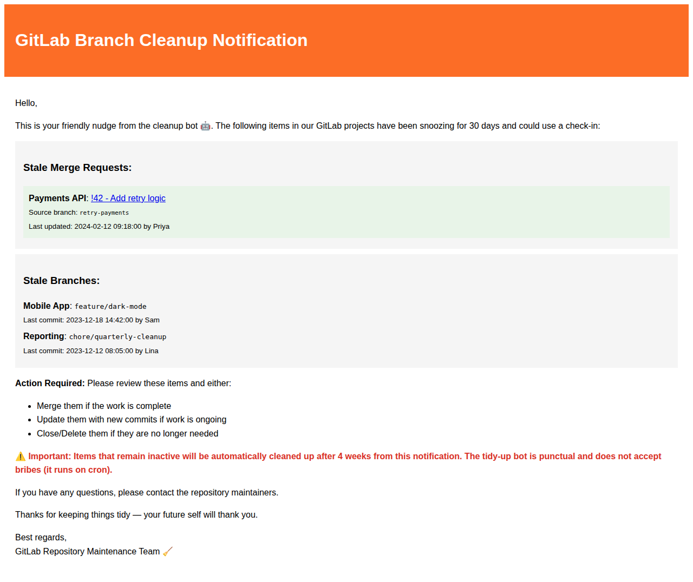

# GitLab Stale Branch/Merge Request Notifier

A Python script that identifies stale branches and merge requests in GitLab projects and sends email notifications to their owners about upcoming cleanup.

## Features

- **Detect stale merge requests** based on any activity (commits, comments, reviews, etc.)
- **Detect stale branches** where the last commit is older than a configurable number of days (if no MR exists)
- **Smart MR activity detection** - checks both MR metadata updates and note/comment activity
- **Smart email routing for MRs** - uses MR assignee, author, or fallback email for notifications
- **Check committer status** - verifies if the committer's GitLab profile is active
- **Smart email routing for branches** - uses fallback email if the committer's profile is inactive
- **HTML email notifications** including:
  - List of stale merge requests with project, MR link, and last activity information
  - List of stale branches with project and commit information
  - Notification for cleanup action required
  - Warning about automatic cleanup after a configurable number of weeks
- **Dry-run mode** for testing without sending emails
- **Skips protected branches** to avoid notifying about main/master branches

## Installation

1. Clone the repository:
   ```bash
   git clone https://github.com/Re4zOon/repo-maintainer.git
   cd repo-maintainer
   ```

2. Install dependencies:
   ```bash
   pip install -r requirements.txt
   ```

3. Copy the example configuration and edit it:
   ```bash
   cp config.yaml.example config.yaml
   # Edit config.yaml with your settings
   ```

## Configuration

Create a `config.yaml` file with the following settings:

```yaml
# GitLab connection settings
gitlab:
  url: "https://gitlab.example.com"
  private_token: "your-gitlab-private-token"

# Project IDs to check for stale branches
# IMPORTANT: Only the repositories listed here will be scanned.
# This script does NOT scan all repositories in your GitLab instance.
# You must explicitly list each project ID you want to monitor.
projects:
  - 123
  - 456

# Number of days after which a branch is considered stale
stale_days: 30

# Number of weeks until automatic cleanup (mentioned in notification)
cleanup_weeks: 4

# Fallback email for inactive users or when MR assignee/author cannot be identified
fallback_email: "repo-maintainers@example.com"

# SMTP settings
smtp:
  host: "smtp.example.com"
  port: 587
  use_tls: true
  username: "notifications@example.com"
  password: "your-smtp-password"
  from_email: "GitLab Maintenance <notifications@example.com>"
```

## Usage

### Basic Usage

```bash
python stale_branch_mr_handler.py
```

### With Custom Configuration File

```bash
python stale_branch_mr_handler.py -c /path/to/config.yaml
```

### Dry Run (No Emails Sent)

```bash
python stale_branch_mr_handler.py --dry-run
```

### Verbose Output

```bash
python stale_branch_mr_handler.py -v
```

## How It Works

1. **Connects to GitLab** using the provided API token
2. **Iterates through configured projects** and retrieves all open merge requests
3. **Identifies stale MRs** based on the latest activity (including notes/comments)
4. **Filters out protected branches** (main, master, etc.)
5. **Identifies stale branches** based on the last commit date (only for branches without open MRs)
6. **For stale MRs**: Groups by MR assignee/author email and sends MR notifications
7. **For stale branches without MRs**: Groups by branch committer email
8. **Checks if users are active** in GitLab
9. **Sends notification emails** to active users, or to fallback email for inactive users

## Email Template

The notification email includes:
- List of stale merge requests with project name, MR link, source branch, and last update date
- List of stale branches with project name, branch name, and last commit date
- Instructions for handling the items (merge, update, close, or delete)
- Warning about automatic cleanup timeline

The template also includes a friendly reminder from the cleanup bot to keep the tone light.

### Email Notification Preview

Example subject lines:
- `[Action Required] 3 Stale Item(s) Require Attention`
- `[Action Required] 1 Stale Merge Request(s) Require Attention`
- `[Action Required] 2 Stale Branch(es) Require Attention`

Example email excerpt (MRs + branches):

```
Hello,
This is your friendly nudge from the cleanup bot 🤖. The following items have been snoozing
for 30 days and could use a check-in:

Stale Merge Requests:
- Payments API: !42 - Add retry logic (source branch: retry-payments, last updated 2024-02-12 by Priya)

Stale Branches:
- Mobile App: feature/dark-mode (last commit 2023-12-18 by Sam)

⚠️ Important: Items that remain inactive will be automatically cleaned up after 4 weeks.
```



To customize the notification layout or wording, edit `EMAIL_TEMPLATE` in
`stale_branch_mr_handler.py`.

## Running Tests

```bash
python -m unittest discover tests/ -v
```

## Finding Project IDs

To find the project ID for a GitLab repository:

1. **Via GitLab UI**: Navigate to your project's main page. The Project ID is displayed in the "Project overview" section or under "Settings > General".

2. **Via GitLab API**:
   ```bash
   curl --header "PRIVATE-TOKEN: your-token" "https://gitlab.example.com/api/v4/projects?search=project-name"
   ```
   The response will include the `id` field for each matching project.

## Requirements

- Python 3.7+
- GitLab API access (private token with `read_api` scope)
- SMTP server for sending emails

## License

MIT License
