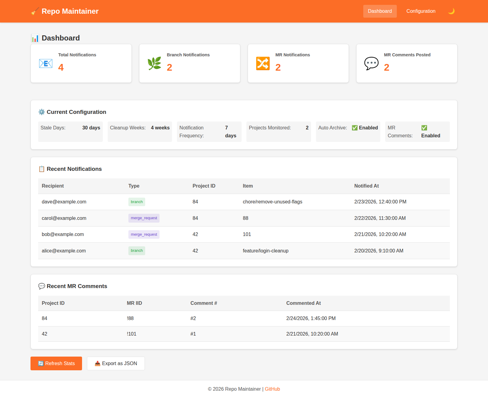
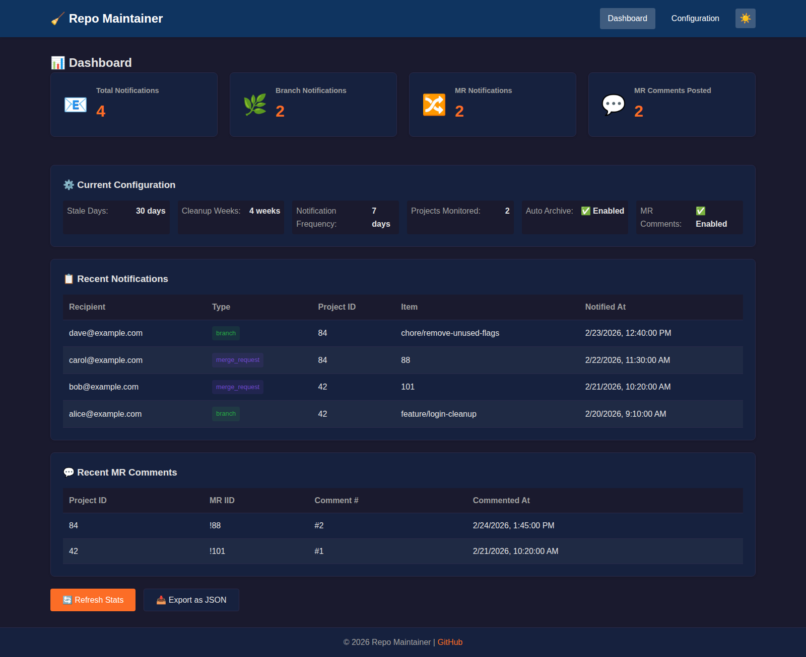
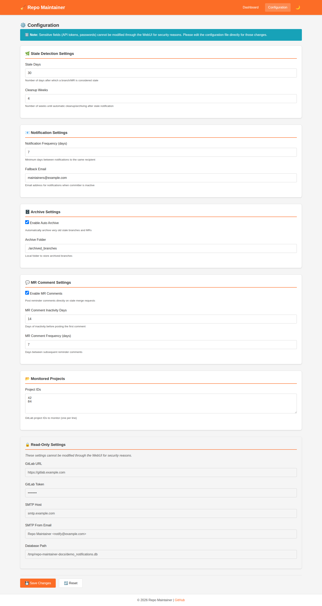

# WebUI Guide

The Repo Maintainer WebUI provides a browser-based way to monitor stale branch/merge request (MR) activity and safely update non-sensitive configuration values.

## At a glance

- **Dashboard** with notification and MR comment stats
- **Recent activity tables** for latest notification/comment history
- **Configuration editor** for stale/cleanup/comment settings and monitored projects
- **Dark mode** toggle for lower-light environments
- **Basic authentication** for all non-health endpoints

## Screenshots

### Dashboard



### Dashboard (dark mode)



### Configuration editor



## Run the WebUI

### Docker Compose (recommended)

```bash
# Create a .env file with your credentials (required)
echo "WEBUI_USERNAME=your-username" > .env
echo "WEBUI_PASSWORD=your-secure-password" >> .env

# Start both the CLI tool and WebUI
docker compose up --build

# Or start just the WebUI
docker compose up repo-maintainer-webui --build
```

Access: `http://localhost:5000`

### Local run

```bash
pip install -r requirements.txt
python -m webui.app -c config.yaml
```

Optional:

```bash
python -m webui.app -c config.yaml --port 8080
python -m webui.app -c config.yaml --debug
```

## API endpoints

| Endpoint | Method | Auth | Description |
|----------|--------|------|-------------|
| `/api/health` | GET | No | Health check |
| `/api/stats` | GET | Yes | Runtime statistics |
| `/api/config` | GET | Yes | Sanitized configuration |
| `/api/config` | PUT | Yes | Update editable configuration fields |

## Environment variables

| Variable | Default | Description |
|----------|---------|-------------|
| `WEBUI_HOST` | Docker: `0.0.0.0` (local: `127.0.0.1`) | Host bind address |
| `WEBUI_PORT` | `5000` | WebUI port |
| `WEBUI_USERNAME` | `admin` | Basic auth username (Docker deployments should override) |
| `WEBUI_PASSWORD` | `admin` | Basic auth password (Docker deployments should override) |
| `WEBUI_SECRET_KEY` | auto-generated | Session secret key |
| `CONFIG_PATH` | `config.yaml` | Config file path |

## Security notes

- Sensitive values (for example, GitLab/GitHub tokens or SMTP password) are intentionally **not editable** in the WebUI.
- Always set `WEBUI_USERNAME`, `WEBUI_PASSWORD`, and preferably `WEBUI_SECRET_KEY` explicitly in shared environments.
